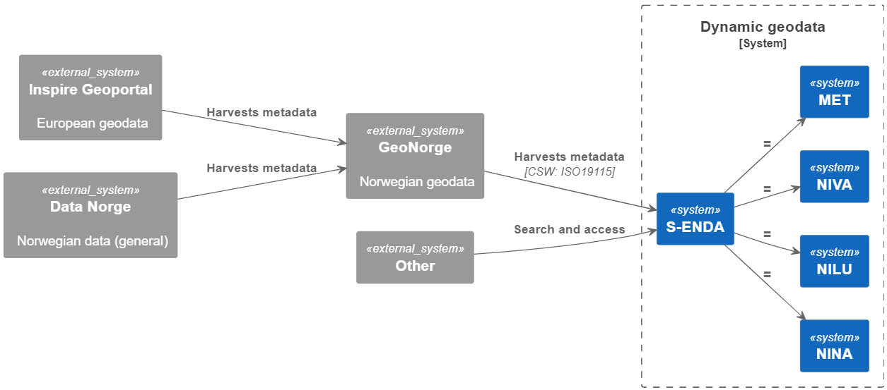

## Introduction

This document describes general data management practices in line with the [FAIR](https://www.go-fair.org/fair-principles/) (Findable, Accessible, Interoperable and Reusable) guiding principles for scientific data management, and focuses on the management and sharing of dynamical geodata (i.e., geolocated data about processes in nature). The practices aim at a metadata-driven data management regime. The primary focus of this handbook is on management of dynamic geodata. It provides a synopsis of the general data management practices of S-ENDA partners. We have prepared an overview for organisation specific information that can be updated and merged into the general handbook by the user organisations.

The purpose of the Data Management Handbook (DMH) is threefold:
1. to provide an overview of the principles for FAIR data management to be employed;
2. to help personnel identify their roles and responsibilities for good data management; and
3. to provide personnel with practical guidelines for carrying out good data management.

The intended audience for this DMH is any personnel involved in the process of making data available for the end user. This process can be viewed as a value chain that moves from the producer of the data to the data consumer (i.e., the end user). The handbook provides description and summary of data management principles. Details of the practical implementation of the principles are described along 4 pillars: structuring and documenting data; data services; user portals and documentation; and data governance. Practical guidance for data producers is also provided.

The DMH is a strategic governing document and should be used as part of the quality framework the organisation is using.

### About S-ENDA

S-ENDA is part of a larger effort within the national geodata strategy (“Alt skjer et sted”), and relates to this strategy through GeoNorge, which is developed and operated by the Norwegian Mapping Authority (“Kartverket”). GeoNorge, in turn, relates to the European [INSPIRE](https://inspire.ec.europa.eu/) Geoportal through the Inspire directive. In particular, S-ENDA is responsible for Action 20 of the Norwegian geodata strategy. The goal of Action 20 is to establish a distributed, virtual data center for use and management of dynamic geodata. S-ENDA’s vision is that everyone, from professional users to the general public, should have easy, secure and stable access to dynamic geodata.

The vision of S-ENDA and the goal of Action 20 are aligned with international guidelines, in particular the FAIR Guiding Principles for scientific data management and stewardship.
S-ENDA in a national and international context

Dynamic geodata is weather, environment and climate-related data that changes in space and time and is thus descriptive of processes in nature. Examples are weather observations, weather forecasts, pollution (environmental toxins) in water, air and sea, information on the drift of cod eggs and salmon lice, water flow in rivers, driving conditions on the roads and the distribution of sea ice. Dynamic geodata provides important constraints for many decision-making processes and activities in society.

GeoNorge is the national website for map data and other location information in Norway. Here, users of map data can search and access such information. Dynamic geodata is one such information type. S-ENDA extends GeoNorge by taking responsibility for harmonising the management of dynamic geodata in a consistent manner.

